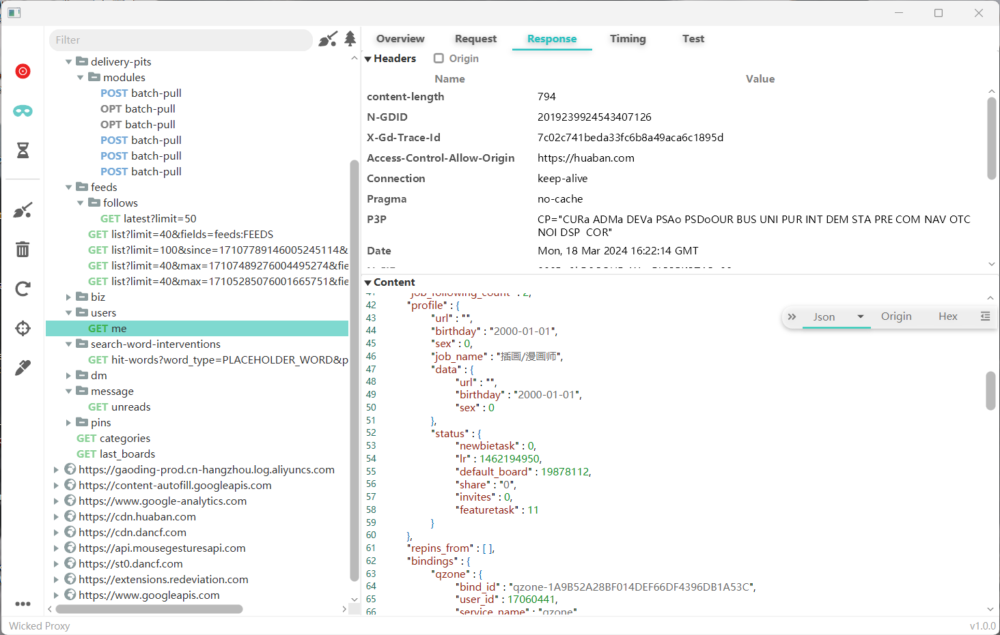
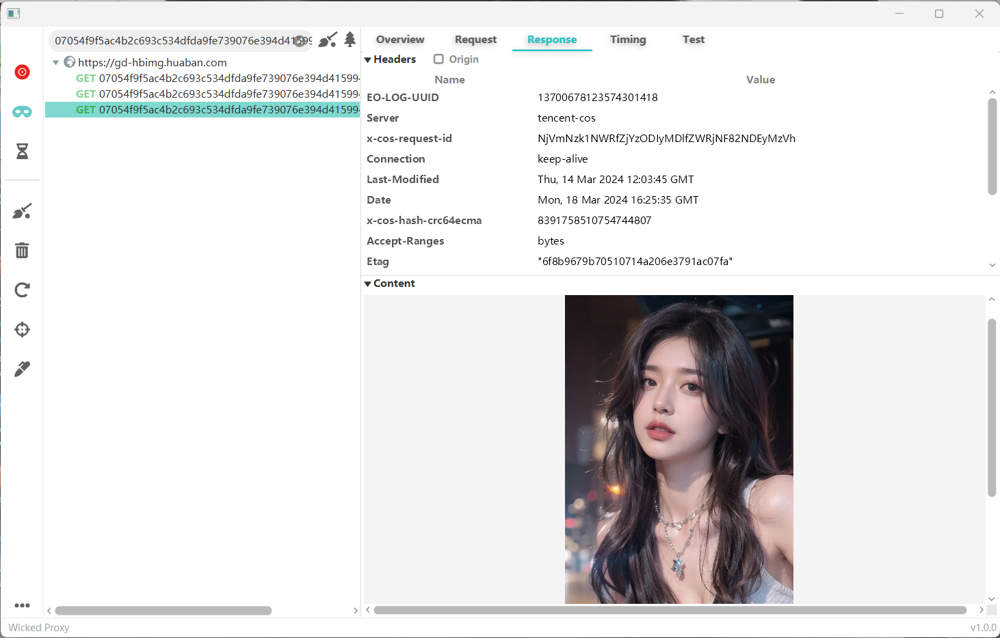
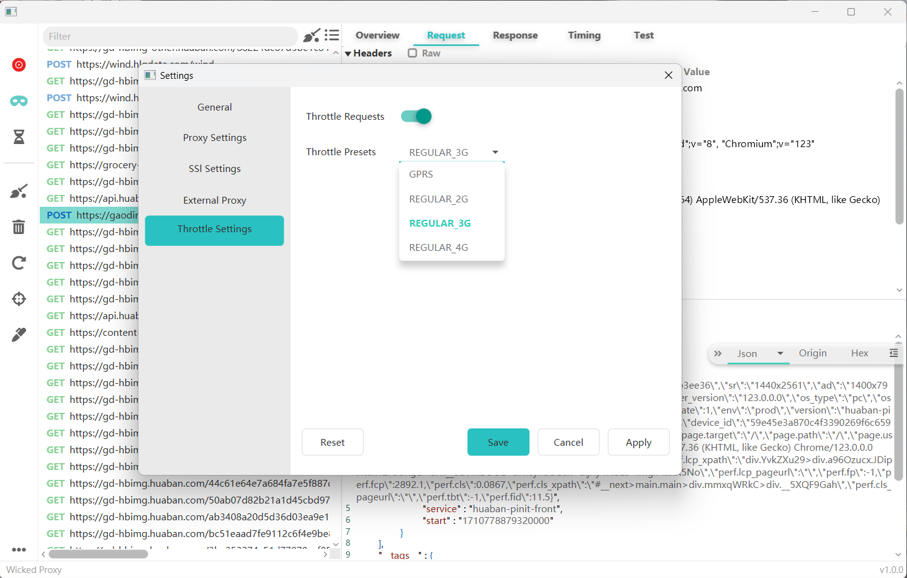

# HumBird Proxy - 【桌面端 Http 代理/抓包工具】

## Introduction
HumBird Proxy 是基于一款由 Java 开发的桌面端 HTTP 代理与抓包工具, 适配 Windows/MacOs/Linux 环境. 
支持 HTTP/HTTPS 代理/解析, Websocket 代理, 自定义 CA 证书, 网速限流等功能.

## Preview

## P.S.
目前还有些 Bug, 修复完成后将发布 Release.

本人是个菜比, 欢迎各路大佬参与此项目并提交 PR, 感激不尽!!

